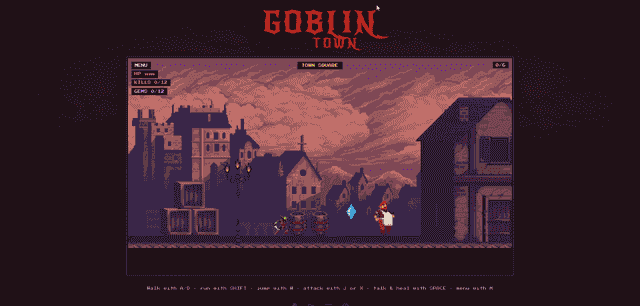

# Goblin Town



**A portfolio you play.** A little pixel-art night town you can walk through — houses open onto work, notes, doodles, and a way to say hello.

**▶ Play it live at [g0.monster](https://g0.monster)** · Prefer reading? There's a plain summary at [g0.monster/info](https://g0.monster/info/).

## What's here

- **/** — the town (move, talk, fight, open doors, leave a doodle)
- **/info** — text summary of everything
- **/work/[slug]** · **/blog/[slug]** — project & post pages

## Built with

- [Astro](https://astro.build) + vanilla TypeScript canvas engine (no game framework)
- [Cloudflare Pages + Workers](https://pages.cloudflare.com) for hosting and server routes
- [Firebase](https://firebase.google.com) (Firestore) for blogs, comments, and the visitor doodle wall
- Pixel art from the Gothicvania packs (Ansimuz / itch.io)

## Run it locally

```bash
npm install
npm run dev      # https://localhost:4321
npm run build    # production build into dist/
```

## Me

Grew up in Nepal. Live in Tokyo. IT engineer by day; side projects, open source, and weird experiments by night.

- Email: grgvishal.gurung17@gmail.com
- GitHub: [g0GobliN](https://github.com/g0GobliN)
- Instagram: [goblin01_](https://instagram.com/goblin01_)

## Art & sound

Pixel assets from the Gothicvania packs (Ansimuz / itch.io) — see licenses under `public/img/gothicvania/`. Site code is MIT; those packs keep their own terms.
