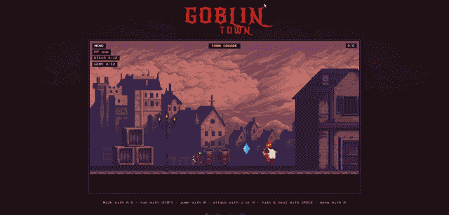

# Goblin Town

**A portfolio you play.** A little pixel-art night town you can walk through — houses open onto work, notes, doodles, and a way to say hello.

**▶ Play it live at [v1.monster/game](https://v1.monster/game/)** · Prefer reading? The portfolio itself is at [v1.monster](https://v1.monster/).

## What's here

- **/** — text portfolio: work, notes, doodles, contact
- **/game** — the town (move, talk, fight, open doors, leave a doodle)
- **/contact** — email, GitHub, Instagram
- **/work/[slug]** · **/blog/[slug]** — project & post pages

## Built with

- [Astro](https://astro.build) + vanilla TypeScript canvas engine (no game framework)
- [Cloudflare Pages + Workers](https://pages.cloudflare.com) for hosting and server routes
- [Firebase](https://firebase.google.com) (Firestore) for blogs, comments, and the visitor doodle wall
- Pixel art from the Gothicvania packs (Ansimuz / itch.io)

## Me

Grew up in Nepal. Live in Tokyo. IT engineer by day; side projects, open source, and weird experiments by night.

- Email: hello@v1.monster
- GitHub: [g0GobliN](https://github.com/g0GobliN)
- Instagram: [goblin01_](https://instagram.com/goblin01_)

## License

Licensed under [CC BY-NC 4.0](https://creativecommons.org/licenses/by-nc/4.0/) — give credit, no commercial use (no selling, no monetizing). See [LICENSE](LICENSE).

## Art & sound

Pixel assets from the Gothicvania packs (Ansimuz / itch.io) — see licenses under `public/img/gothicvania/`. Those packs keep their own terms.
